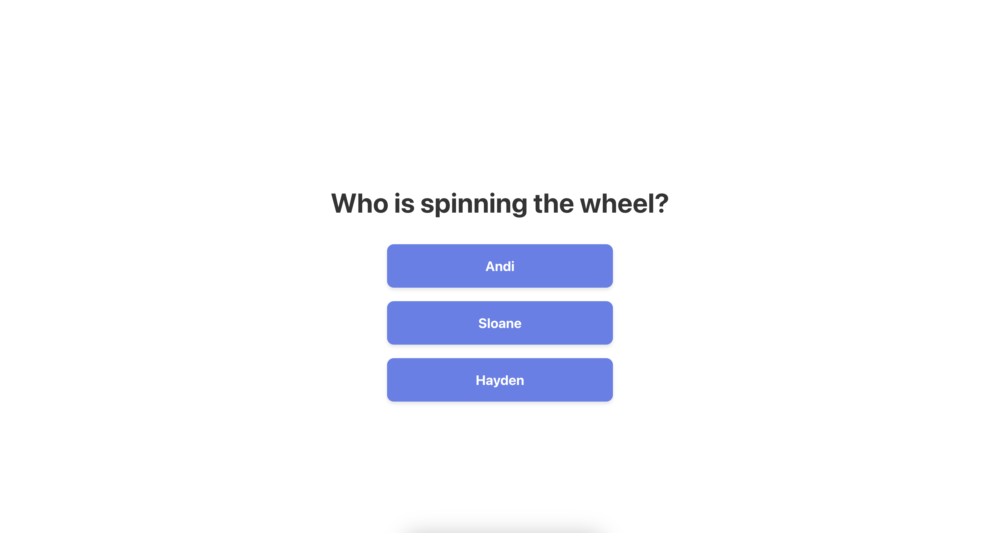
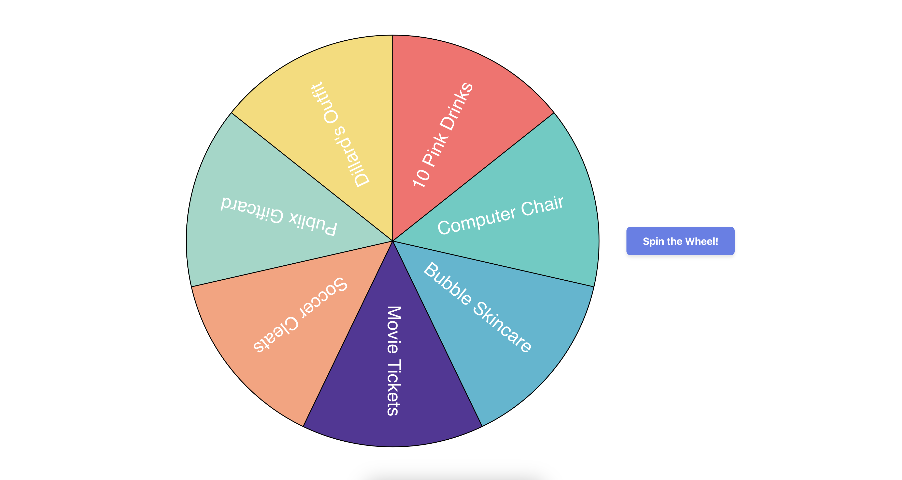
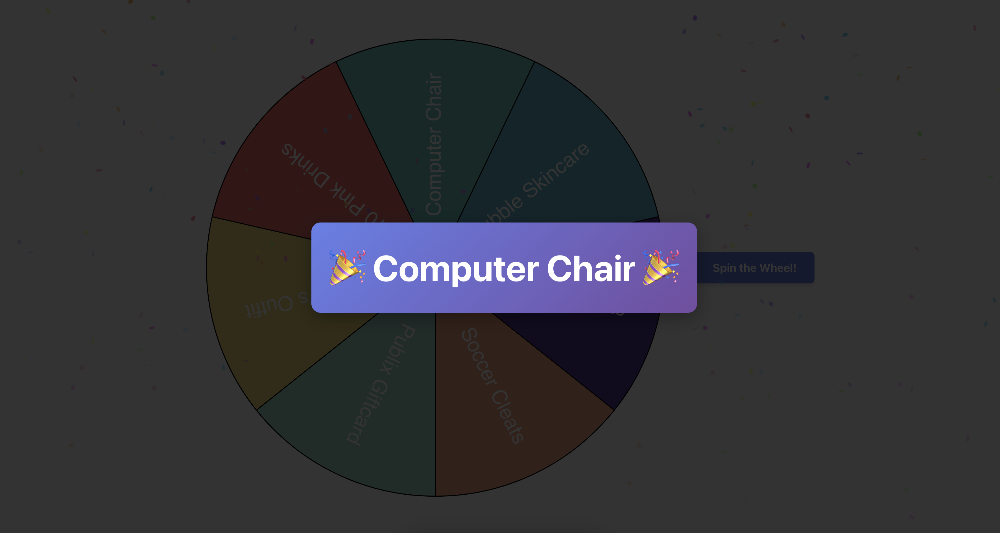

# Spin The Wheel 🎡

A spin-the-wheel application created as a toy project for Christmas. This app allows you to create a spinning wheel with multiple items, where one item is guaranteed to be the winner. 

Check out the preview [here](https://1gm.github.io/spin-the-wheel/).

## Overview

Application capabilities include...
- Select from a predefined list of people
- Spin a wheel with custom items and colors
- Watch the wheel spin and land on a guaranteed winning item
- Celebrate with confetti and animations when the winner is revealed



*The main selection screen where users choose who is spinning the wheel*



*The spinning wheel interface with custom items and colors*



*The celebration screen that appears when the wheel lands on the winning item*

## How It Works

1. **Person Selection**: When you first visit the app, you'll see a screen asking "Who is spinning the wheel?" with buttons for each available person.

2. **Wheel Display**: After selecting a person, you'll see their personalized wheel with all their items displayed in colorful segments.

3. **Spinning**: Click the "Spin the Wheel!" button to start the animation. The wheel will spin multiple times before landing on the predetermined winning item.

4. **Celebration**: When the wheel stops, a celebration modal appears with confetti and displays the winning item.

## Customization

### Updating Items on the Wheel

To modify the items displayed on each person's wheel, edit the `src/data.ts` file. Each person has their own array of items with the following structure:

```typescript
export const personName: SpinTheWheelItem[] = [
  { 
    name: 'Item Name',           // The text displayed on the wheel segment
    color: '#FF6B6B',            // The background color of the segment (hex code)
    isWinningItem: false,        // Set to true for the item that will always win
  },
  // ... more items
];
```

**Example:**
```typescript
export const andi: SpinTheWheelItem[] = [
  { name: 'Cinammon Roll Doll', color: '#FF6B6B', isWinningItem: false },
  { name: 'New Backpack', color: '#4ECDC4', isWinningItem: false },
  { name: "Tony's Sushi", color: '#45B7D1', isWinningItem: false },
  { name: `Clare's Shopping Spree`, color: '#573299', isWinningItem: true }, // This will win!
  { name: 'Amazon Giftcard', color: '#FFA07A', isWinningItem: false },
  // ... more items
];
```

**Important Notes:**
- Only **one item** per person should have `isWinningItem: true`
- You can add as many items as you want to each person's wheel
- Colors should be valid hex color codes (e.g., `#FF6B6B`, `#4ECDC4`)

### Updating Names on the Main Page

To add, remove, or modify the names that appear on the person selection screen, edit the `personNames` array in `src/data.ts`:

```typescript
export const personNames = ['andi', 'sloane', 'hayden'] as const;
```

**To add a new person:**
1. Create a new array in `src/data.ts` with their items (following the same structure as existing people)
2. Add the new person's data to the `personData` object:
   ```typescript
   export const personData: Record<string, SpinTheWheelItem[]> = {
     andi,
     sloane,
     hayden,
     newPerson,  // Add your new person here
   };
   ```
3. Add their name to the `personNames` array:
   ```typescript
   export const personNames = ['andi', 'sloane', 'hayden', 'newPerson'] as const;
   ```

**To remove a person:**
1. Remove their array from `src/data.ts`
2. Remove them from the `personData` object
3. Remove their name from the `personNames` array

**To rename a person:**
1. Update their name in the `personNames` array
2. Update the key in the `personData` object to match
3. Optionally rename the exported array variable (though this is not required)

## Development

### Getting Started

```bash
# Install dependencies
npm install

# Start development server
npm run dev

# Build for production
npm run build
```

### Tech Stack

- **React** - UI framework
- **TypeScript** - Type safety
- **React Router** - Client-side routing
- **Vite** - Build tool and dev server
- **spin-wheel** - Wheel animation library
- **canvas-confetti** - Celebration animations

## Routes

- `/` - Person selection screen
- `/:name` - Individual wheel page (e.g., `/sloane`, `/andi`, `/hayden`)

## Deployment to GitHub Pages

This application is configured for easy deployment to GitHub Pages.

### Prerequisites

- A GitHub repository
- Node.js and npm installed

### Deployment Steps

1. **Update the base path** (if needed):
   - If your repository name is different from `spin-the-wheel`, update the base path in `vite.config.ts`
   - Or set the `VITE_BASE_PATH` environment variable when building:
     ```bash
     VITE_BASE_PATH=/your-repo-name/ npm run build
     ```

2. **Deploy to GitHub Pages**:
   ```bash
   npm run deploy
   ```

   This command will:
   - Build the application for production
   - Deploy the `dist` folder to the `gh-pages` branch
   - Make your app available at `https://yourusername.github.io/spin-the-wheel/`

3. **Enable GitHub Pages** (if not already enabled):
   - Go to your repository settings on GitHub
   - Navigate to "Pages" in the left sidebar
   - Under "Source", select the `gh-pages` branch
   - Click "Save"

4. **Access your deployed app**:
   - Your app will be available at: `https://yourusername.github.io/spin-the-wheel/`
   - Note: It may take a few minutes for the changes to propagate

### Custom Domain (Optional)

If you want to use a custom domain:
1. Update the base path in `vite.config.ts` to `/`
2. Follow GitHub's instructions for setting up a custom domain

### Troubleshooting

- **404 errors on routes**: Make sure the base path in `vite.config.ts` matches your repository name
- **Assets not loading**: Verify that the base path includes a trailing slash (e.g., `/spin-the-wheel/`)
- **Build fails**: Ensure all dependencies are installed with `npm install`

## License

This is a personal toy project created for Christmas fun. Feel free to use and modify as needed!
